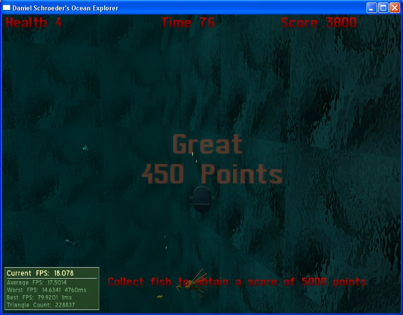

# Ocean Explorer

A simple game created using C++ and Ogre3D in 2007.

## Get it

[Download the zip](Installers/) containing the executable and check it out.

To play the game, go into the "bin\release" folder and run "Assignment.exe". There are also instructions for how to run the game from the source code in Visual Studio 2005 in the "How To Run Game.txt" file.

## History

I developed Ocean Explorer for my CS809 university class in 2007 using C++ and the Ogre3D graphics engine.
Basically you control a submarine and swim around a 3D ocean completing objectives while avoiding the shark.
The fish flock in groups and the shark uses a simple AI where if the shark is hungry it will hunt fish, and if it is full it will hunt your submarine.
There are 5 levels, but I still have to add music and sounds to the game; it is still fully playable though.

I've uploaded the code and assemblies for posterity sake.
Feel free to check out [the source code](src/) 🙂
However, please don't judge me by it as it was written near the start of my programming career when I still had much to learn 😉
